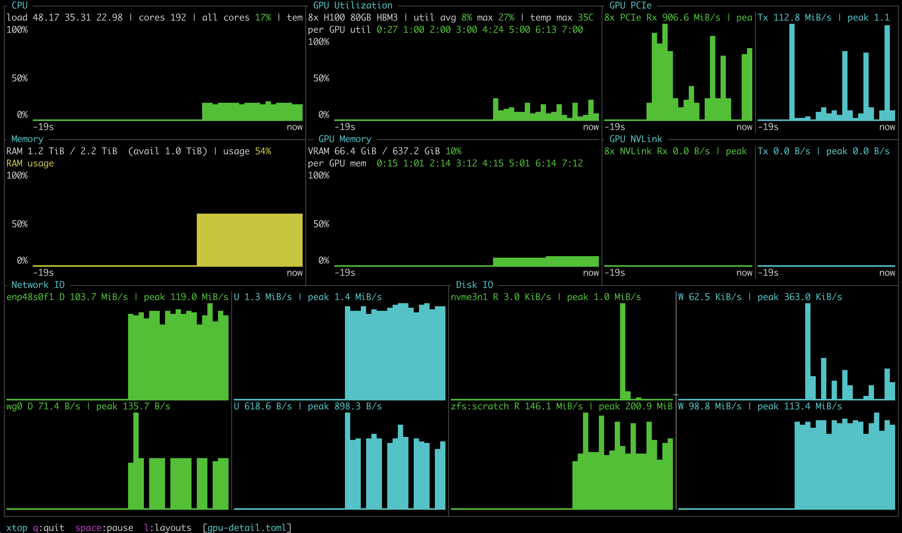

# xtop

A lightweight, configurable, btop-like terminal system monitor written in Rust.

- Multi-core CPU (joint all-core utilization, load average, and optional temperature)
- NVIDIA GPU via NVML (utilization + VRAM history, temperature, power), with
  auto compact/per-device rendering and graceful fallback when no driver/GPU is present
- Memory (RAM + optional swap and current-usage bar)
- Disk IO (physical block devices plus optional ZFS pool counters)
- Network IO (per interface, down/up rates and totals)
- **Fully configurable widget layout** and selectable layout profiles via TOML

It samples native OS counters directly (Linux `/proc`/`/sys`, macOS Mach/sysctl,
getifaddrs, and IOKit) and renders with [`ratatui`](https://ratatui.rs) +
`crossterm`, producing a small statically-strippable binary with minimal idle
overhead.

> Platform: Linux supports CPU, memory, network, disk, Linux OpenZFS pools, and
> NVIDIA GPU metrics via NVML. macOS supports CPU, memory, network, and disk;
> Apple GPU metrics and macOS ZFS pool counters are currently unavailable.

## Screenshot

The default dashboard shows CPU, memory, GPU, network, and disk activity in a
single terminal view, with each panel backed by the same configurable layout
tree described below.



## Quickstart: Compile, Install, Run

Prerequisite: install Rust with `cargo` using
[rustup](https://rust-lang.org/tools/install/).

```bash
make install
xtop
```

`make install` compiles an optimized release binary and installs it to
`~/.local/bin/xtop` by default. To install somewhere else, set `PREFIX`:

```bash
make install PREFIX=/usr/local
```

For development, compile a debug build with:

```bash
make
```

Build and run the TUI directly with:

```bash
make run
```

For a headless / scripting one-shot text dump (no terminal required):

```bash
xtop --probe
# or
xtop --once
```

## Release binaries

Tagged releases publish downloadable binaries as GitHub Release assets; the
compiled artifacts are not committed to this repository. Download the newest
assets from the [latest release](https://github.com/joydeep-b/xtop/releases/latest).

Tagged release assets currently include Linux amd64 builds:

```text
xtop-v0.1.1-x86_64-unknown-linux-gnu.tar.gz   # GPU-capable; needs glibc + NVIDIA driver/NVML
xtop-v0.1.1-x86_64-unknown-linux-musl.tar.gz  # More portable; NVIDIA GPU metrics unavailable
```

Use the GNU/glibc build on NVIDIA systems. The musl build is useful for
CPU-only/minimal systems, but its static libc configuration does not support the
dynamic library loading needed to open NVML.

macOS users can build from source with `make` or `make install`; macOS release
artifacts will be useful once the macOS collector coverage has settled.

For maintainers, publish a release by creating and pushing a version tag that
matches the crate version:

```bash
git tag -a v0.1.1 -m "Release v0.1.1"
git push origin v0.1.1
```

The release workflow builds and uploads both assets automatically. GPU metrics
still require the host NVIDIA driver and NVML library at runtime.

### Controls

| Key             | Action                 |
| --------------- | ---------------------- |
| `q`             | quit                   |
| `Esc`           | quit, or close chooser |
| `Ctrl-C`        | quit                   |
| `space` / `p`   | pause/resume           |
| `l`             | choose layout/profile  |
| `j`/`k`, arrows | move in chooser        |
| `Enter`         | select layout/profile  |

## Configuration

On startup, xtop creates its platform config directory and copies any missing
bundled layout profiles into it without overwriting existing files. On macOS
this is `~/Library/Application Support/xtop`; on Linux/XDG this is usually
`${XDG_CONFIG_HOME:-~/.config}/xtop`. The bundled profiles are:

- [`default.toml`](config/default.toml): balanced CPU, memory, GPU, network, and
  disk dashboard.
- [`gpu-detail.toml`](config/gpu-detail.toml): GPU dashboard with PCIe and
  NVLink transfer panels.
- [`simple.toml`](config/simple.toml): CPU, memory, network, and disk layout for
  CPU-only systems, laptops, and small SSH sessions.

Any key you omit falls back to the built-in defaults, so a partial file is fine.

Every TOML file in the config directory is a selectable layout/config profile
except `selected.toml`, which xtop manages as a symlink to the active profile.
Use `l` in the TUI to choose a profile; selecting one updates `selected.toml` so
the same profile is used on restart. If `selected.toml` is absent, xtop loads
`default.toml`.

### Layout: a recursive split tree

The layout is the standout feature. It is a tree of **splits** (a direction +
children) and **widget** leaves, mapped directly onto the terminal area. Each
child carries a `size`:

| `size` form        | Meaning                                  |
| ------------------ | ---------------------------------------- |
| `"NN%"`            | percentage of the parent                 |
| `"fill"` / `"min"` | take remaining space (fills share evenly)|
| `{ length = N }`   | fixed N rows (vertical) / cols (horizontal) |
| `{ ratio = [a,b]}` | proportional share                       |

Available widgets: `cpu`, `memory`, `gpu`, `gpu_util`, `gpu_memory`,
`gpu_pcie`, `gpu_nvlink`, `disk`, `network`. `gpu` renders utilization and
memory together, switching to a compact aggregate view automatically when many
GPUs are present. `gpu_util` and `gpu_memory` let layouts split those graphs
into matching panels. `gpu_pcie` and `gpu_nvlink` graph PCIe and NVLink transfer
rates (Rx/Tx); like `gpu`, they show one graph pair per device and switch to a
compact aggregate view (totals summed across GPUs) automatically when many GPUs
are present. They honor the `widgets.gpu.mode` setting (`auto` / `compact` /
`per_device`).

> PCIe throughput comes from NVML as an instantaneous ~20 ms sample (not an
> average over the update interval), so the graph is a coarse estimate rather
> than an integrated rate. NVLink uses NVML's modern aggregate throughput
> counters; `gpu_nvlink` shows "No NVLink" on devices/drivers without it.

These GPU transfer widgets are not in the default layout. To try them, select
the bundled `gpu-detail.toml` profile with `l`.

```toml
[settings]
update_ms = 1000   # sampling + redraw interval
history   = 240    # samples kept for graphs
theme     = "default"   # or "mono"
graph_style = "braille" # braille / bar

[layout]
direction = "vertical"
children = [
  { size = "58%", split = { direction = "horizontal", children = [
      { size = "50%", split = { direction = "vertical", children = [
          { size = "50%", widget = "cpu" },
          { size = "50%", widget = "memory" },
      ] } },
      { size = "50%", split = { direction = "vertical", children = [
          { size = "50%", widget = "gpu_util" },
          { size = "50%", widget = "gpu_memory" },
      ] } },
  ] } },
  { size = "fill", split = { direction = "horizontal", children = [
      { size = "50%", widget = "network" },
      { size = "50%", widget = "disk" },
  ] } },
]

[widgets.disk]
devices = []            # empty = auto; Linux nvme0n1/sda, macOS disk0/disk1
zfs_pools = []          # Linux OpenZFS only; empty = auto-detect imported pools
graph_style = "bar"     # override global graph_style

[widgets.network]
interfaces = []         # empty = auto; Linux eth0/enp*, macOS en0/en1
graph_style = "bar"     # override global graph_style
```

### Widget options

Each widget can override the global graph style with `graph_style = "braille"`
or `graph_style = "bar"`.

```toml
[widgets.cpu]
graph_style = "bar"

[widgets.memory]
graph_style = "bar"
show_swap = true        # show swap usage text + gauge
show_usage_bar = true   # show the current RAM usage bar above history

[widgets.gpu]
graph_style = "bar"
mode = "auto"           # auto / compact / per_device

[widgets.disk]
devices = ["nvme0n1"]   # Linux example; use ["disk0"] on macOS; [] = auto
zfs_pools = ["tank"]    # Linux OpenZFS via /proc/spl/kstat/zfs; [] = auto
```

Want CPU stacked over GPU on the left and memory taking the whole right half?
Just restructure the tree:

```toml
[layout]
direction = "horizontal"
children = [
  { size = "50%", split = { direction = "vertical", children = [
      { widget = "cpu" },
      { widget = "gpu" },
  ] } },
  { size = "50%", widget = "memory" },
]
```

### NVIDIA / GH200 notes

GPU monitoring uses NVML from the NVIDIA driver stack; the CUDA toolkit is not
required. Some driver installs expose only the versioned NVML soname
(`libnvidia-ml.so.1`) instead of the unversioned development symlink
(`libnvidia-ml.so`). xtop uses NVML through `nvml-wrapper` on Linux.

If NVML loads but the driver is not accessible, validate from a GPU allocation
and check `nvidia-smi -L`. 

## Project layout

```
src/
  main.rs             entry point, event loop, sampler thread, --probe mode
  config.rs           TOML config + recursive layout-tree model
  layout.rs           resolves the layout tree into terminal rects
  panel.rs            shared panel borders and titles
  event.rs            keyboard input -> actions
  theme.rs            color palettes
  util.rs             byte/rate formatting
  collectors/         platform sampling backends (cpu, memory, gpu, disk, net)
  widgets/            one ratatui renderer per metric
config/default.toml   bundled balanced dashboard
config/gpu-detail.toml bundled GPU transfer layout
config/simple.toml    bundled CPU/memory/IO layout
```
